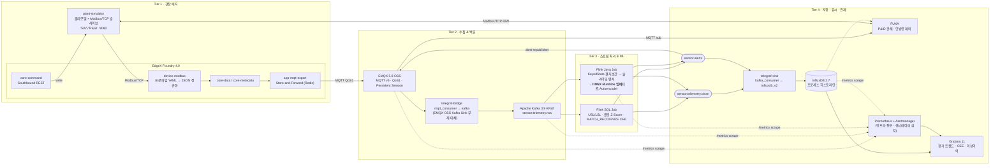

# IIoT / SCADA 실시간 파이프라인 — 통합 아키텍처 (as-built v1.0)

> 출처: `IoT SCADA 파이프라인 아키텍처.pdf` (15p)
> 목표: PDF가 권고한 스택을 **실제 동작하는 SCADA 예제**로 구현. `docker compose up` 한 번으로 기동, 코드 수정 없이 **설정 파일만으로** 전 구간 동작.
> 검증 환경: macOS / **linux-arm64 (Apple Silicon)** / Docker 29.1.2 / Compose v2.40.3 / Docker 메모리 33GB
>
> **이 문서는 구현 완료 후 실측값으로 갱신되었습니다.** 설계 단계의 가정과
> 실제로 다르게 판명된 부분은 본문에 표시해 두었습니다. 구현 중 부딪힌 함정은
> [docs/GOTCHAS.md](docs/GOTCHAS.md), 실행 방법은 [README.md](README.md) 를 보세요.

---

## 0. 먼저: PDF 권고안 중 "OSS로는 불가능한 것" 2가지

실사 결과, PDF가 전제한 구성 중 **오픈소스만으로는 성립하지 않는 지점**이 두 군데 있습니다. 여기가 이번 설계의 핵심 의사결정입니다.

| # | PDF 권고 (p.10, Tier 2 / Tier 3) | 실사 결과 | 본 설계의 대안 |
|---|---|---|---|
| **1** | "EMQX의 **데이터 통합 브리지**를 통해 센서 텔레메트리를 Kafka `sensor.telemetry.raw` 토픽으로 적재" | ❌ **EMQX Kafka Sink는 Enterprise 전용.** EMQX OSS(v5.x)에는 Rule Engine은 있으나 Kafka 프로듀서 커넥터가 없음 | ✅ **Telegraf**를 MQTT→Kafka 브리지로 배치 (`mqtt_consumer` in → `kafka` out). Apache 2.0, TOML 설정만, 공식 이미지. PDF가 Tier 4에서 이미 "Telegraf 컨슈머" 를 언급하므로 스택 일관성 유지 |
| **2** | "Flink 태스크 매니저 내부에 **C++ 기반 ONNX Runtime**을 임베디드 서빙" | ⚠️ PyFlink로 하려면 불가 — **`apache-flink`는 linux-aarch64 휠이 없음** (PyPI: macosx_arm64 / manylinux_x86_64 만 존재). Apple Silicon 컨테이너에서 소스 빌드 실패 | ✅ **Java Flink Job + `com.microsoft.onnxruntime:onnxruntime` (JNI→native C++)**. PDF 원문 의도("C++ 기반 ONNX Runtime 임베디드")에 오히려 더 정확히 부합. Maven 빌드는 Dockerfile builder stage에 포함 → 사용자는 여전히 `docker compose up` 한 번 |

그 외 **PDF 권고안은 전부 그대로 구현 가능**함을 이미지 레벨까지 확인했습니다 (EdgeX 4.0 / EMQX 5.8 / Kafka 3.9 KRaft / Flink 1.20 / InfluxDB 2.7 / Grafana 11 / FUXA / Prometheus — **전부 arm64 멀티아치 지원 확인 완료**).

---

## 1. 대상 공정: AR-100 반응기 라인 (Reactor Line)

"동작하는 SCADA"가 되려면 **제어하면 물리량이 실제로 변하는 공정**이 있어야 합니다. 순수 Python으로 물리 모델(질량수지 · 에너지수지)을 구현하고 **Modbus/TCP 슬레이브**로 노출합니다.

```
   TK-101              P-101            R-101 (교반 반응기)           CV-101
  원료탱크   ──────▶  공급펌프(VFD) ──▶  ┌──────────────────┐  ──▶  배출제어밸브 ──▶ 제품
  LT-101               FT-101           │ LT-102  TT-101   │       FT-102
                       IT-101           │ PT-101  pH-101   │
                                        │    M-101 교반기   │
                                        │  IT-102  VT-101  │
                                        └────── HX-101 ────┘
                                              재킷히터 TT-102
```

**계측 태그 12점** (다변량 Autoencoder 입력 차원 = 12)

| 태그 | 설명 | 단위 | LSL / USL |
|---|---|---|---|
| LT-101 | 원료탱크 레벨 | % | 10 / 95 |
| LT-102 | 반응기 레벨 | % | 15 / 90 |
| TT-101 | 반응기 온도 | °C | 40 / 95 |
| TT-102 | 재킷 온도 | °C | – / 120 |
| PT-101 | 반응기 압력 | barg | – / 6.0 |
| FT-101 | 공급 유량 | m³/h | – / – |
| FT-102 | 배출 유량 | m³/h | – / – |
| IT-101 | 펌프 전류 | A | – / 14.0 |
| IT-102 | 교반기 전류 | A | – / 9.6 (정격 8.0의 120%) |
| VT-101 | 교반기 베어링 진동 | mm/s | – / 7.1 |
| pH-101 | 반응기 pH | – | 6.2 / 8.4 |
| CT-101 | 전도도 | mS/cm | – / – |

**제어 포인트 (Southbound — 양방향 SCADA 루프)**

| 주소 | 종류 | 설명 |
|---|---|---|
| Coil 0 | R/W | P-101 펌프 기동/정지 |
| Coil 1 | R/W | M-101 교반기 기동/정지 |
| Coil 2 | R/W | HX-101 히터 Enable |
| Coil 10 | R/W | **알람 Acknowledge** |
| HR 100 | R/W | P-101 속도 SP (0–100 %) |
| HR 101 | R/W | CV-101 밸브 개도 SP (0–100 %) |
| HR 102 | R/W | 반응기 온도 SP (°C ×10) |
| Coil 20 | RO | **고압 인터록 발동 상태** (PT-101 > 6.5 시 펌프 강제 트립) |

> 인터록은 시뮬레이터 내부에서 결정론적으로 동작합니다. PDF가 지적한 "Grafana는 인터록/에코체크를 보장 못한다"(p.11)는 한계를 FUXA + 시뮬레이터 인터록으로 실증합니다.

**고장 주입 API** (시뮬레이터 REST `:8080/fault`) — 각 시나리오가 파이프라인의 특정 주장을 검증합니다.

| 시나리오 | 주입 내용 | 검증 대상 |
|---|---|---|
| `dropout` | 특정 태그 N초간 발행 중단 | **Flink 결측치 보간** (LOCF / 선형) |
| `spike` | PT-101 순간 과압 | **Tier-1 USL 규칙** (수 ms 알람) |
| `noise` | TT-101 분산 급증 | **Tier-1 롤링 Z-Score** |
| `bearing_wear` | IT-102 ↑ 후 10초 내 VT-101 ↑ (상관 고장) | **Flink CEP `MATCH_RECOGNIZE`** |
| `drift` | pH-101 · CT-101 동시 미세 드리프트 (단일 임계치로는 탐지 불가) | **Tier-2 Autoencoder** (다변량 재구성 오차) |
| `netdown` | 에지↔중앙 링크 차단 | **EdgeX Store-and-Forward** |

---

## 2. 통합 아키텍처



### 2.1 계층별 컴포넌트 · 설정 방식

| Tier | 서비스 | 이미지 | 설정 수단 (코드 없음) |
|---|---|---|---|
| 1 | `plant-simulator` | 자체 빌드 (python:3.12-slim) | `plant.yaml` (공정 파라미터 · 태그맵 · 고장 시나리오) |
| 1 | EdgeX ×8 | `edgexfoundry/*:4.0.0` | `device-modbus` 프로파일 YAML + `configuration.yaml` |
| 2 | EMQX | `emqx/emqx:5.8.6` | `emqx.conf` (HOCON) — QoS1 / 세션영속 / ACL |
| 2 | Kafka | `apache/kafka:3.9.0` | 환경변수 (KRaft single-node) + `topics.sh` init |
| 2 | telegraf-bridge | `telegraf:1.33` | `bridge.conf` (TOML) |
| 3 | Flink JM/TM | `flink:1.20-scala_2.12-java17` | `flink-conf.yaml` + Prometheus reporter |
| 3 | Flink SQL Job | sql-client | **`pipeline.sql`** (순수 SQL — 보간·규칙·CEP) |
| 3 | Flink ONNX Job | 자체 빌드 (maven builder) | `job.yaml` (윈도우 크기 · 임계치 · 모델 경로) |
| 3 | model-trainer | 자체 빌드 (python:3.12 + torch-cpu) | `train.yaml` — 1회 실행 후 `model.onnx` 산출 |
| 4 | telegraf-sink | `telegraf:1.33` | `sink.conf` (TOML) |
| 4 | InfluxDB | `influxdb:2.7` | `DOCKER_INFLUXDB_INIT_*` 환경변수 |
| 4 | Grafana | `grafana/grafana:11.4.0` | provisioning YAML + 대시보드 JSON |
| 4 | FUXA | `frangoteam/fuxa:latest` | `project.json` → `POST /api/project` 자동 프로비저닝 |
| 4 | Prometheus / Alertmanager / kafka-exporter / cadvisor | 공식 | `prometheus.yml` + `rules.yml` + `alertmanager.yml` |

> **FUXA 프로비저닝 검증 완료**: FUXA는 `POST /api/project`로 전체 프로젝트(devices + hmi views)를 주입 가능 (`server/api/projects/index.js:91`). `fuxa-provisioner` init 컨테이너가 기동 후 P&ID 화면·태그바인딩·제어버튼이 담긴 JSON을 업로드합니다. 수동 화면 그리기 불필요.

---

## 3. 데이터 계약 (전 구간 단일 스키마)

EdgeX 경유/직결 어느 경로든 Kafka 진입 시점에 **동일 스키마로 정규화**합니다 (정규화는 Telegraf 브리지가 담당).

```json
{
  "ts":       1758000000123456789,
  "site":     "AR-100",
  "device":   "reactor-line-01",
  "tag":      "TT-101",
  "value":    72.43,
  "quality":  "GOOD",
  "seq":      184213
}
```
- `ts`: **나노초** (InfluxDB 정밀도 활용 — PDF p.7 표 근거)
- `seq`: QoS1 중복 수신 대비 **멱등 키** (PDF p.4 권고). Flink에서 `(device,tag,seq)` 기준 dedup.
- `quality`: `GOOD` | `INTERPOLATED_LOCF` | `INTERPOLATED_LINEAR` | `STALE`
  → **PDF p.5의 핵심 권고 반영**: 보간값이 원천 계측치를 덮어쓰지 않도록, `raw` 토픽은 무손실 원본 유지 / `clean` 토픽에만 보간값을 기록하고 **`quality` 태그로 추정치를 명시**. InfluxDB에서도 `quality`가 태그로 저장되어 감사 추적(Audit Trail)이 성립합니다.

**Kafka 토픽**

| 토픽 | 파티션 | 생산자 | 내용 |
|---|---|---|---|
| `sensor.telemetry.raw` | 6 | telegraf-bridge | 무손실 원본 (보간 없음) |
| `sensor.telemetry.clean` | 6 | Flink | dedup + 보간 완료, `quality` 부착 |
| `sensor.anomaly.score` | 3 | Flink(ONNX) | 재구성 오차 + 기여도 상위 센서 |
| `sensor.alerts` | 3 | Flink(SQL+ONNX) | Tier1/Tier2 통합 알람 |

파티션 키 = `device:tag` → 태그 단위 순서 보장 + Flink keyed state 정합.

---

## 4. 이상 탐지 2계층 설계 (PDF p.8–9 구현)

**Tier 1 — Flink SQL (`pipeline.sql`, 순수 선언형)**
1. **USL/LSL**: `tag_limits` 조인 후 즉시 알람
2. **롤링 Z-Score**: `OVER (PARTITION BY tag ORDER BY ts ROWS BETWEEN 59 PRECEDING AND CURRENT ROW)` 로 μ·σ 산출 → `|z| > 3.0`
3. **CEP**: `MATCH_RECOGNIZE` 로 PDF p.8 예시를 그대로 표현
   ```sql
   PATTERN (OVERCURRENT VIB) WITHIN INTERVAL '10' SECOND
   DEFINE OVERCURRENT AS tag='IT-102' AND value > 9.6,
          VIB        AS tag='VT-101' AND value > 7.1
   ```
   → Esper/EQL을 Flink CEP로 대체하라는 PDF 결론 2를 실증

**Tier 2 — Flink Java Job + 임베디드 ONNX**
- 입력: 12태그 × 10스텝 슬라이딩 윈도우 (1초 간격) = **120차원 텐서**
- 결측 처리: Keyed `ValueState`로 LOCF, 양단 값 존재 시 선형 보간 → `quality` 마킹
- 추론: `OrtSession.run()` **TaskManager 프로세스 내부 호출** (네트워크 홉 0 — PDF p.10 "RPC Callout 지양" 준수)
- 판정: 재구성 오차 MSE > θ (학습 데이터 99.5 백분위) → `sensor.alerts` 발행 + **기여도 상위 3개 센서 역추적**
- 모델: `model-trainer`가 기동 시 1회 실행 — 정상 운전 데이터 생성 → Dense Autoencoder(120→32→8→32→120) 학습 → `torch.onnx.export` → 공유 볼륨

---

## 5. Prometheus vs InfluxDB 역할 분리 (PDF p.7 결론 5 강제)

**설계 규약: Prometheus는 센서 태그를 단 하나도 저장하지 않습니다.**

| | InfluxDB (히스토리안) | Prometheus (인프라 감시) |
|---|---|---|
| 저장 대상 | 12개 공정 태그, 이상 점수, 알람 이력 | EMQX 세션수/처리량, **Kafka 컨슈머 랙**, Flink 체크포인트 소요·실패, InfluxDB 디스크 I/O, 컨테이너 CPU/MEM |
| 수집 | Push (Line Protocol, Telegraf) | Pull (scrape) |
| 카디널리티 | site·device·tag·quality (고카디널리티) | 서비스 단위 (저카디널리티) |

Alertmanager 룰 (파이프라인 자체 장애만):
`KafkaConsumerLagHigh` · `FlinkCheckpointFailed` · `EMQXDisconnectSpike` · `TelegrafWriteError` · `EdgeXStoreForwardBacklog`

---

## 6. 시각화 이원화 (PDF p.11 결론 5)

| | **FUXA** (`:1881`) | **Grafana** (`:3000`) |
|---|---|---|
| 역할 | 실시간 감시 **+ 제어** | 장기 분석 (읽기 전용) |
| 데이터원 | MQTT (실시간 태그·알람) + **Modbus/TCP (제어)** | InfluxDB + Prometheus |
| 화면 | P&ID 미믹 — 펌프 회전 애니메이션, 배관 유체 흐름, 밸브 개도, 알람 점멸 | ① 공정 트렌드 ② ML 이상 탐지 ③ 파이프라인 건전성 |
| 제어 | 펌프 ON/OFF, 속도 SP 슬라이더, 밸브 개도, 온도 SP, 알람 ACK, **고장 주입 버튼** | 없음 |

FUXA가 Modbus로 **직접 쓰기**하므로, 버튼 클릭 → 레지스터 변경 → 물리모델 반응 → 센서값 변화 → EdgeX → EMQX → Kafka → Flink → InfluxDB → Grafana 까지 **전 구간 왕복 루프가 눈으로 확인**됩니다.

---

## 7. 채택 / 미채택 결정

**채택**: EdgeX Foundry · EMQX · Kafka(KRaft) · Flink(SQL + CEP + ONNX) · InfluxDB · Telegraf · Grafana · FUXA · Prometheus/Alertmanager

**미채택 (사유 명시)**

| 기술 | 미채택 사유 |
|---|---|
| **ThingsBoard** | EdgeX(디바이스 관리·Southbound) + FUXA(HMI·RPC 위젯)와 역할 100% 중복. PDF p.12 표에서도 "사용자 제안 스택"과 대안 관계 |
| **Apache StreamPipes** | 노코드 분석 계층. Flink SQL이 동일 역할을 더 높은 확장성으로 수행 (PDF p.12: StreamPipes는 "딥러닝 텐서 처리에 제약") |
| **ksqlDB** | Flink SQL이 상위 호환. PDF p.6 결론에서도 Flink 우선 권고 |
| **Esper/EQL** | PDF 결론 2가 명시적으로 Flink CEP 대체를 권고 |
| **TimescaleDB** | InfluxDB와 택일. 나노초 정밀도 + Line Protocol 푸시가 본 예제에 적합 |
| **EMQX Enterprise** | Kafka Sink는 매력적이나 **상용 라이선스**. "오픈소스 예제" 목표와 충돌 → Telegraf로 대체 |

---

## 8. 디렉터리 구조 (예정)

```
edge-platform/
├── docker-compose.yml              # 전체 스택
├── docker-compose.edgex.yml        # EdgeX 8종 (프로파일 분리)
├── .env                            # 포트·버전·자격증명 일괄
├── Makefile                        # up / down / demo / fault / logs
├── simulator/       plant.yaml · Dockerfile · sim.py
├── edgex/           device-profile.yaml · devices.yaml · configuration.yaml
├── emqx/            emqx.conf · acl.conf
├── kafka/           create-topics.sh
├── telegraf/        bridge.conf · sink.conf
├── flink/
│   ├── conf/        flink-conf.yaml
│   ├── sql/         pipeline.sql          # Tier-1 전체 (선언형)
│   └── onnx-job/    pom.xml · src/ · Dockerfile   # Tier-2
├── ml/              train.yaml · train.py · Dockerfile
├── influxdb/        init.sh
├── grafana/         provisioning/ · dashboards/*.json
├── fuxa/            project.json · provision.sh   # P&ID 화면 자동 주입
├── prometheus/      prometheus.yml · rules.yml · alertmanager.yml
└── docs/            RUNBOOK.md · DEMO.md · VERIFICATION.md
```

## 9. 검수 시나리오 (구현 후 실증할 항목)

| # | 시나리오 | 기대 결과 | PDF 근거 |
|---|---|---|---|
| 1 | FUXA에서 펌프 기동 + 속도 70% | Modbus 쓰기 → 레벨/유량 상승이 Grafana 트렌드까지 <3초 내 반영 | p.11 양방향 SCADA |
| 2 | `dropout` TT-101 15초 | `raw`엔 공백 유지, `clean`엔 `quality=INTERPOLATED_*` 로 채움 | p.5 선택적 보간 |
| 3 | `spike` PT-101 | Tier-1 알람 <100ms + 고압 인터록 발동 → 펌프 트립 | p.8 USL |
| 4 | `bearing_wear` | Flink CEP 패턴 매치 알람 | p.8 CEP |
| 5 | `drift` pH+CT | 단일 임계치 무반응, **Autoencoder만 탐지** + 기여 센서 역추적 | p.9 Tier-2 |
| 6 | `netdown` 30초 | EdgeX Store-and-Forward 후 복구 시 순서대로 재전송, **무손실** | p.4 |
| 7 | Flink TM 강제 kill | 체크포인트 복구, `sensor.alerts` 중복/유실 없음 | p.6 Exactly-once |
| 8 | Kafka 컨슈머 지연 유발 | Prometheus 랙 알람 발화 (InfluxDB엔 무영향) | p.7 역할분리 |

---

## 10. 리스크

| 설계 단계 리스크 | 실제 결과 |
|---|---|
| **EdgeX 4.0 부트스트랩 복잡도** (Consul + 8서비스 예상) | 실제로는 Consul 이 아니라 **core-keeper**, Redis 가 아니라 **PostgreSQL** 이었음. 예상대로 가장 까다로웠고 4가지 함정(의존성 조건 / `-o` 플래그 / 공통설정 위치 / 프로파일 권한)을 해결해야 했음 → [GOTCHAS 1~5](docs/GOTCHAS.md) |
| Flink ONNX Job **Maven 빌드 시간** | 최초 약 3분, 이후 레이어 캐시로 즉시 |
| onnxruntime Java **linux-aarch64 네이티브** 포함 여부 | ✅ **포함 확인** (`ai/onnxruntime/native/linux-aarch64/libonnxruntime.so`, 13.6MB). 리스크 해소 |
| 총 컨테이너 / 메모리 | 실측 **29개 / 약 8GB** (lite 프로파일 19개) |
| FUXA P&ID JSON 수작업 생성 | 생성기로 해결. 다만 FUXA 의 Modbus 주소 체계(1-based, 코일 영역 `"000000"`)와 플러그인 런타임 설치는 소스를 읽어야 알 수 있었음 → [GOTCHAS 17~19](docs/GOTCHAS.md) |

### 설계 단계에서 예상하지 못했던 것

| 항목 | 내용 |
|---|---|
| PyFlink arm64 부재 | 설계 시 이미 발견해 Java 로 전환 — 올바른 판단이었음 |
| **Jackson 이중 충돌** | Flink 런타임과의 충돌(relocate 로 해결) 위에, 셰이드 JAR 내부의 core/databind 버전 불일치가 또 있었음 (BOM 으로 해결) |
| **Flink 이미지의 JVM 모듈 옵션** | 설정 파일을 교체하면 `env.java.opts.all` 이 사라져 잡 제출이 실패 |
| **Z-Score 오탐** | 설정치 램프 구간에서 정상 운전 중 z=3.0~3.1 오탐. 지속성 조건(최근 5중 3회)으로 90초 오탐 0건 달성 |
| **오토인코더 학습 데이터 설계** | 설정치가 고정된 정상 데이터로는 학습할 상관 구조가 없어 단일 태그 Z-Score 와 구별 불가. autopilot 도입으로 해결했으나, 변동을 너무 키우면 반대로 고장이 묻힘 — 판별력 자가검증을 학습 파이프라인에 넣어 균형을 강제 |


---

## 11. 실측 결과 (as-built)

### 성능

| 지표 | 실측 |
|---|---|
| 센서 유입 | 12 건/초 (12태그 × 1 Hz) |
| EdgeX autoEvent | 1 이벤트/초 (12 리딩 묶음) |
| **ONNX 추론 지연** | **0.16 ~ 0.18 ms** (TaskManager 내부 직접 호출) |
| Flink 잡 | 4개 RUNNING (Tier-1 SQL 3 + Tier-2 ONNX 1) |
| 정상 운전 오탐 | **90초간 0건** |

### 오토인코더 판별력 (학습 직후 자가검증)

| 시나리오 | 평균 재구성오차 | 탐지율 | 담당 계층 |
|---|---|---|---|
| 정상 | 0.021 | 0.5 % | – |
| drift | 55.8 | 100 % | **Tier-2 전담** (임계치로는 불가) |
| bearing_wear | 146.1 | 100 % | Tier-1 CEP + Tier-2 |
| spike | 17.4 | 100 % | Tier-1 규칙 선행 |
| noise | 0.031 | 3.6 % | Tier-1 Z-Score 전담 |

### 데이터 무결성 (InfluxDB 실측)

| quality | 건수 |
|---|---|
| `GOOD` | 15,858 |
| `INTERPOLATED_LINEAR` | 42 |

원본(`process_raw`)에는 결측 구간이 공백으로 남고, 정제본(`process`)에만
보간값이 `quality` 표기와 함께 들어갑니다.

### 역할 분리 (실측)

Prometheus 스크랩 타깃 7개(emqx / kafka / flink×2 / influxdb / cadvisor / prometheus)
전부 정상이며, **공정 센서 태그는 단 하나도 저장되지 않습니다.**
