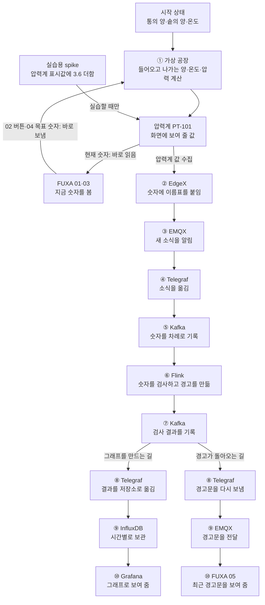

# 이 화면은 뭐 하는 걸까요?

**컴퓨터 안에 만든 작은 공장을 보는 화면**이에요. 진짜 기계는 움직이지 않아요.

공장에서는 **재료를 통에서 꺼내 → 큰 솥으로 보내 → 저으면서 데운 뒤 → 밖으로 내보내요.**


화면에 적힌 큰 번호 `01, 02, 03, 04, 05`만 따라가 봅시다.

## 01 공정 흐름: 공장 지도

왼쪽부터 **재료통 → 물을 밀어 보내는 기계(펌프) → 큰 솥(반응기) → 나가는 문(밸브)**이 있어요.

- **재료통의 `레벨`**: 통이 얼마나 찼는지예요. `90%`면 거의 가득 찬 거예요.
- **큰 솥의 `온도`**: 얼마나 뜨거운지예요.
- **큰 솥의 `압력`**: 솥 안에서 얼마나 세게 밀고 있는지예요.
- **큰 솥의 `레벨`**: 솥에 재료가 얼마나 찼는지예요.

통과 솥 **그림은 위치를 알려 주는 지도**예요. 안에 든 양은 그림 모양이 아니라 **숫자**로 확인해요.

## 02 운전원 조작: 공장 리모컨

**초록 `기동`은 켜기, 빨간 `정지`는 끄기**예요.

| 누르는 것 | 무슨 일이 생기나요? | 어디를 보나요? |
|---|---|---|
| **펌프 기동** | 재료를 솥으로 보내요 | `공급 유량`: 들어오는 재료의 양이 늘어요 |
| **펌프 정지** | 재료 보내기를 멈춰요 | `공급 유량`이 0에 가까워져요 |
| **교반기 기동·정지** | 솥 안을 젓거나 멈춰요 | `교반기 전류`: 기계가 쓰는 전기가 달라져요 |
| **히터 기동·정지** | 솥을 데우거나 멈춰요 | `온도`가 **천천히** 달라져요 |

버튼 오른쪽 **`1`은 “켜라고 말했어요”**, **`0`은 “끄라고 말했어요”**라는 뜻이에요. 정말 켜졌는지는 오른쪽 숫자만 보지 말고 **들어오는 양이나 온도**도 살펴봐요.

**고압 인터록**은 이름이 어렵지만 **압력이 너무 높으면 펌프를 막는 안전장치**예요. 여기가 `1`이면 안전장치가 작동한 거예요. **알람 확인 ACK**는 “경고를 봤어요”라는 신호를 보내는 버튼이에요. 이 버튼이 고장을 고치거나 경고 글씨를 지우지는 못해요.

## 03 전체 계측: 지금 공장은 어떤가요?

여기는 공장 곳곳에 붙여 둔 **숫자판**이에요. `PT-101` 같은 글자는 숫자판마다 붙인 **이름표**예요.

| 이름표 | 알려 주는 것 |
|---|---|
| `LT-101`, `LT-102` | 재료통과 솥이 얼마나 찼는지 |
| `TT-101`, `TT-102` | 솥과 데우는 부분이 얼마나 뜨거운지 |
| `PT-101` | 솥 안의 압력이 얼마나 높은지 |
| `FT-101`, `FT-102` | 재료가 얼마나 들어오고 나가는지 |
| `IT-101`, `IT-102` | 펌프와 젓는 기계가 전기를 얼마나 쓰는지 |
| `VT-101` | 젓는 기계가 얼마나 떨리는지 |
| `pH-101` | 재료가 **시큼한 쪽인지 아닌지** |
| `CT-101` | 재료에 **전기가 얼마나 잘 통하는지** |

처음에는 **압력 `PT-101`**과 **들어오는 양 `FT-101`**만 찾아보세요.

## 04 설정값: 우리가 원하는 숫자

**설정값은 기계에게 알려 주는 ‘원하는 정도’**예요. `02`의 버튼이 **전원 스위치**라면, `04`의 설정값은 **세기를 조절하는 다이얼**이에요. 에어컨을 켜는 버튼과 “24도로 맞춰 줘”라는 숫자가 따로 있는 것과 같습니다.

| 흰 칸에 넣는 값 | 무슨 뜻인가요? | 바꾼 뒤 무엇을 보나요? |
|---|---|---|
| **펌프 속도 `60`** | 펌프를 최대 속도의 **60% 정도**로 돌려 달라는 요청 | `FT-101 공급 유량`이 달라지는지 봐요. 펌프가 **정지**해 있거나 안전장치가 막으면, 속도를 60으로 적어도 재료는 흐르지 않아요. |
| **밸브 개도 `45`** | 나가는 문을 **45% 열어 달라는 요청** | `FT-102 배출 유량`이 달라지는지 봐요. 문을 열어도 솥에 든 양에 따라 나가는 양은 달라요. |
| **온도 ×10에 `720`** | 솥의 목표를 **72.0도**로 맞춰 달라는 요청. 이 칸은 온도를 10배 한 숫자로 적어요. | `TT-101`의 **실제 온도**를 봐요. 히터가 꺼져 있으면 목표값만 바꿔도 데워지지 않아요. 켜져 있어도 온도는 천천히 움직여요. |

**왜 이 칸이 있나요?** 같은 공장이라도 재료를 **빨리 넣을지**, **얼마나 빼낼지**, **얼마나 데울지** 정해야 하기 때문이에요. 이를 바꾸면 솥에 든 양과 온도가 바뀌고, 압력도 **간접적으로** 달라질 수 있어요. **압력 자체를 6.3으로 입력하는 칸은 아닙니다.**

흰 칸 **오른쪽 숫자는 지금 저장된 목표**, `03 전체 계측`의 숫자는 **실제로 측정한 결과**예요. 둘은 같지 않아도 됩니다. 이 연습용 공장은 정상 운전을 보여 주려고 목표를 가끔 자동으로 조금씩 바꾸며, 사람이 직접 바꾸면 약 5분 동안 그 값을 우선합니다.

**실제로 바꾸는 방법:** 흰 칸을 누르고 새 숫자를 쓴 다음 **Enter**를 누르세요. **숫자만 쓰거나 Tab으로 다른 칸으로 옮기는 것으로는 저장되지 않았습니다.** Enter를 누른 뒤 **입력칸 오른쪽의 목표 숫자**가 새 값으로 바뀌는지 먼저 확인하세요. 펌프 속도를 바꿨다면 아래 `FT-101 공급 유량`도 함께 살펴보세요.

[Enter 안내가 보이는 실제 화면](../화면캡처/35_SCADA_설정값_Enter_안내.png)

## 05 최근 분석 알람: 마지막 경고

컴퓨터가 숫자를 살펴보다가 “어? 압력이 높네!”라고 생각하면 여기에 **경고문**을 띄워요. 경고문에 `PT-101`이 보이면 **압력 때문에 나온 경고**예요.

이곳은 **마지막 경고문**을 보여 줘요. 압력이 다시 낮아져도 글이 남아 있을 수 있어요. **지금 괜찮은지** 알려면 `03`의 현재 압력을 다시 봐요.

[압력이 높아졌을 때 화면](../화면캡처/33_SCADA_고압경고_시연.png)을 보면 압력 칸이 **주황색**이에요. 더 높아지면 **빨간색**이 되고 펌프 안전장치가 작동할 수 있어요. **주황색인데 안전장치는 아직 `0`일 수도 있어요.** 경고를 알려 주는 선과 기계를 멈추는 선이 서로 다르기 때문이에요.

## 화면 뒤에 숨어 있는 프로그램들

압력계가 “압력이 높아요!”라고 말하면, 여러 프로그램이 그 말을 **전달하고, 검사하고, 보관**해요. 이름은 외울 필요 없어요. 무슨 일을 하는지만 보면 돼요.

| 프로그램 이름 | 하는 일 |
|---|---|
| **FUXA** | 공장을 보는 **리모컨**. 숫자를 보고 버튼을 눌러요. |
| **Modbus** | 리모컨과 공장이 서로 이야기할 때 쓰는 **말**이에요. |
| **EdgeX** | 공장의 숫자를 받고 “이건 압력!”이라고 **이름표를 붙여요.** |
| **EMQX** | 새 숫자가 왔다고 여러 곳에 알려 주는 **방송국**이에요. |
| **MQTT** | 방송국이 소식을 전할 때 쓰는 **전달 방법**이에요. |
| **Telegraf** | 숫자를 다음 프로그램으로 옮기는 **배달원**이에요. |
| **Kafka** | 들어온 숫자를 차례대로 적어 두는 **공책**이에요. |
| **Flink** | 공책을 읽고 이상한 숫자를 찾는 **검사원**이에요. |
| **InfluxDB** | “몇 시에 얼마였나?”를 적어 두는 **일기장**이에요. |
| **Grafana** | 일기장의 숫자를 **그래프**로 그려 줘요. |
| **Prometheus** | 이 프로그램들이 잘 일하는지 보는 **건강검진표**예요. |

## 맨 처음 숫자는 어디서 오나요?

**진짜 공장이라면 실제 압력계가 압력을 재겠지만, 여기에는 진짜 공장이 없습니다.** 대신 `시뮬레이터`라는 프로그램이 공장 흉내를 냅니다. 마치 게임 속 자동차가 속도를 계산하듯, 이 프로그램도 **1초마다** 재료의 양·온도·압력을 계산합니다. “압력 숫자를 만든다”는 말은 **아무 숫자나 적는다는 뜻이 아니라, 공장 상태를 계산한다는 뜻**입니다.

계산에 들어가는 것은 세 종류입니다.

| 들어가는 것 | 쉬운 예 | 어떤 영향을 주나요? |
|---|---|---|
| **시작할 때 정해 둔 상태** | 원료통은 약 70%, 솥은 약 55% 차 있고, 솥 온도는 약 52도에서 시작 | 계산을 시작할 출발점이 됩니다. 화면을 한참 켜 둔 뒤에는 이 값과 달라집니다. |
| **화면에서 보낸 명령·목표** | 펌프 켜기, 펌프 속도 60%, 나가는 문 45% 열기, 목표 온도 72도 | 재료가 들어오고 나가는 양과 솥 온도가 달라집니다. |
| **실습용 고장 주입** | 압력계 값이 갑자기 튀는 `spike` | 계산된 압력에 **3.6을 더해 압력계에 표시**합니다. |

예를 들어 펌프가 재료를 보내면 솥에 든 양이 바뀝니다. 히터가 데우면 솥 온도가 바뀝니다. 이 프로그램은 **솥에 든 양과 온도**를 보고 기본 압력을 계산합니다. 그리고 압력계처럼 보이는 `PT-101`에 그 값을 올립니다. 그러니까 **압력을 6.3으로 직접 입력하는 칸은 없습니다.** `6.3`은 상황을 설명하기 위한 예시이고, 그때그때 실제 숫자는 달라질 수 있습니다.

```text
펌프·밸브·히터의 동작 → 솥에 든 양과 온도 변화 → 기본 압력 계산 → PT-101 표시
```

솥에 재료가 더 차면 위쪽 빈 공간이 줄고, 솥을 데우면 안쪽이 더 뜨거워집니다. 이 둘이 압력 계산에 쓰입니다. 계산 방법에는 솥의 크기와 처음 채워 둔 기체의 압력 같은 **미리 정한 규칙**도 들어 있습니다. 또 이 연습용 공장은 정상 운전을 보여 주기 위해 목표값을 가끔 스스로 조금씩 바꿉니다.

`spike` 실습은 조금 다릅니다. 솥을 실제로 더 데우는 대신, **압력계가 말하는 숫자만 갑자기 높여** 고장 상황을 흉내 냅니다. 가상 공장의 안전장치는 이 압력계 숫자를 보기 때문에, 숫자가 충분히 높으면 펌프 공급을 막을 수도 있습니다.

```text
예시: 계산된 압력 2.7 + spike 3.6 = 압력계가 보고하는 값 6.3
```

## 압력이 올라간 날: 숫자 하나를 따라가 봐요

처음에는 큰 솥의 압력이 낮습니다. 실습에서 압력계 숫자를 튀게 하는 `spike`를 넣었다고 해 봅시다. 가상 공장은 **기본 압력을 계산한 뒤 압력계가 보고할 값에 3.6을 더합니다.** 그 결과 `PT-101`이 예를 들어 **6.3**을 가리킵니다. FUXA는 가상 공장에 **바로 물어봐서** 화면에 그 값을 보여 줍니다. 그래서 운전원은 다른 프로그램의 검사가 끝나기 전에도 압력 숫자가 올라간 것을 볼 수 있습니다. 압력 칸도 주황색으로 바뀝니다.

같은 숫자를 **EdgeX**도 공장에서 읽습니다. EdgeX는 숫자에 `PT-101 압력`이라는 이름표를 붙입니다. **EMQX**는 이 소식이 왔다고 알리고, **Telegraf**가 소식을 받아 **Kafka 공책**에 적습니다. **Flink**는 새로 적힌 6.3을 읽고 “경고를 줄 만큼 높다”고 판단합니다. 여기까지가 **숫자를 모아 검사하는 길**입니다.

Flink는 검사 결과를 **Kafka 공책에 다시 적습니다.** 그 결과는 두 곳으로 갑니다. 한쪽은 Telegraf를 거쳐 **InfluxDB 일기장**에 저장되고, **Grafana**가 “몇 시에 압력이 올랐나?”를 그래프로 보여 줍니다. 다른 쪽은 Telegraf와 EMQX를 거쳐 FUXA의 `05 최근 분석 알람`으로 돌아옵니다. **FUXA의 압력 숫자와 FUXA의 경고문이 도착하는 길은 서로 다릅니다.**

압력이 **6.5 이상**으로 더 오르면 가상 공장 안의 **안전장치가 직접** 펌프 공급을 막습니다. 이것은 Flink가 명령해서 멈춘 것이 아닙니다. 펌프가 켜져 있었다면 FUXA에서 `FT-101`(들어오는 양)이 0으로 떨어지는지 볼 수 있습니다. 반대로 운전원이 FUXA의 **펌프 정지**를 누르면, 명령은 FUXA에서 가상 공장으로 바로 갑니다. 그 결과로 바뀐 유량이 다시 위의 숫자 여행을 시작합니다.

나중에 압력이 내려가도 FUXA의 `05`에는 **마지막 경고문이 남을 수 있습니다.** 지금 상태는 경고문 대신 `PT-101`의 현재 숫자와 안전장치 `1/0`을 보고 판단합니다.

## 한눈에 보는 전체 순서도

**화살표는 숫자나 명령이 가는 방향**입니다. 첫 번째 갈래는 `지금 보기·버튼 누르기`, 두 번째 갈래는 `모으기·검사하기`입니다.

먼저 아래 네 줄을 따라가고, 그다음 상세 그림을 보세요.

```text
지금 숫자:  가상 공장 ───────────────→ FUXA
버튼 명령:  FUXA ───────────────────→ 가상 공장
숫자의 시작: 시작 상태 + 버튼·목표값 → 가상 공장이 계산 → PT-101 압력계 값
검사:       PT-101 → EdgeX → EMQX → Telegraf → Kafka → Flink
검사 결과:  Kafka 공책에 다시 적음
            ├→ Telegraf → InfluxDB → Grafana (그래프)
            └→ Telegraf → EMQX → FUXA (경고문)
```



그림의 `⑦ Kafka`는 새로운 프로그램이 하나 더 생겼다는 뜻이 아닙니다. **같은 Kafka 공책에 검사 결과도 적는다**는 뜻입니다. `⑧ Telegraf`도 같은 종류의 배달원이지만, **저장소로 가는 배달**과 **경고문을 돌려보내는 배달**을 따로 맡습니다. 그림의 두 EMQX 상자 역시 같은 방송국의 서로 다른 소식 길입니다.

다른 화면을 열었다면 이렇게 생각하세요. **FUXA는 지금 공장을 보는 리모컨**, **Grafana는 지난 숫자의 그래프**, **Flink 화면은 검사원이 일하는지 보는 곳**, **EMQX 화면은 방송국이 일하는지 보는 곳**이에요. **Prometheus**는 이 프로그램들이 건강한지 살핍니다. 별도의 **AI 화면**은 경고를 더 살펴보고 사람이 판단하는 곳이며, AI가 경고를 봤다고 기계가 저절로 움직이지는 않습니다.
