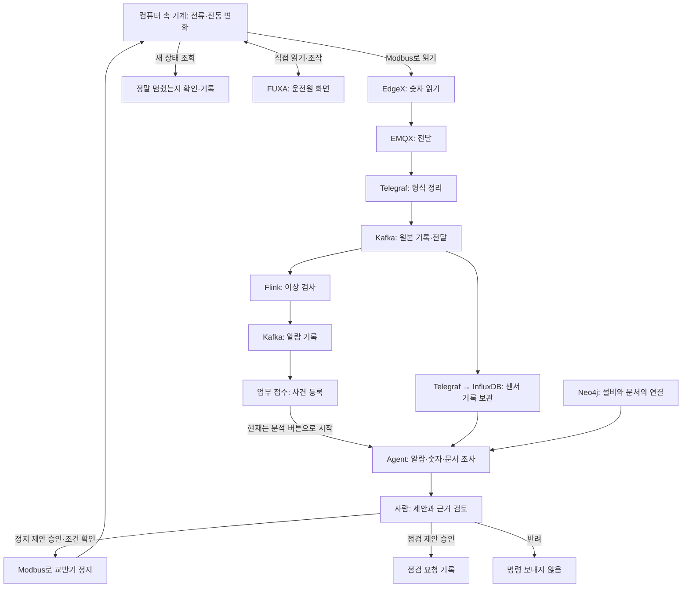

# 기계가 이상해지면, 누가 무엇을 할까요?

2026-09-28 · 기존 아키텍처 보고서 대신 아래의 실제 코드와 설정을 읽어 작성했습니다.
이 문서는 코드의 동작 설명입니다. 이번 작업에서 전체 흐름을 다시 실행해 성공했다는 뜻은 아닙니다.

## 먼저, 딱 한 장면만 생각해 보세요

큰 통 안에서 재료를 섞는 기계가 있습니다. 이름은 **교반기**입니다.
믹서기를 떠올리면 됩니다. 우리 실습에서는 진짜 공장 대신 **컴퓨터 속 가상 기계**를 사용합니다.

어느 날 이 기계가 평소보다 심하게 떨립니다. 전기도 많이 씁니다.
우리가 하고 싶은 일은 간단합니다.

**이상을 알아차리고 → 이유를 살펴보고 → 사람이 멈춰도 된다고 하면 → 멈추고 → 정말 멈췄는지 확인합니다.**

## 1. ‘이상 발생’을 누르면 무엇이 바뀌나요?

컴퓨터 속 기계에 ‘이상한 상황을 연습하자’고 요청합니다.
기계 프로그램이 전기를 쓰는 정도와 떨림을 계산하는 방식을 바꿉니다.
그래서 전류와 진동 숫자가 올라갑니다. 화면의 숫자만 색칠하는 것이 아닙니다.

- **전류:** 모터에 흐르는 전기의 양입니다. 화면에서는 `IT-102`입니다.
- **진동:** 기계가 얼마나 떨리는지입니다. 화면에서는 `VT-101`입니다.

‘이상 발생’을 눌렀다는 사실과 ‘검사 프로그램이 이상을 찾았다’는 사실은 다릅니다.
숫자가 변하고, 전달되고, 검사되는 시간이 필요합니다.

## 2. 숫자는 어떻게 검사하는 곳까지 가나요?

아래는 같은 숫자를 차례로 넘겨주는 길입니다. 이름을 외울 필요는 없습니다.

```text
컴퓨터 속 기계
  │ “지금 전류와 진동은 이 정도예요.”
  ▼
EdgeX — 기계의 숫자를 읽는 담당
  ▼
EMQX — 받은 소식을 다음 담당에게 전달
  ▼
Telegraf — 이름표를 맞춰 정리
  │ “어느 기계 / 어느 센서 / 언제 / 얼마”
  ▼
Kafka — 소식을 기록하고 필요한 프로그램이 읽게 함
  ▼
Flink — 들어온 숫자가 이상한지 검사
```

**Modbus**는 EdgeX가 기계와 이야기할 때 쓰는 약속의 이름입니다.
“여기 있는 숫자를 읽어 주세요”라고 말할 때 사용합니다.
EMQX 쪽으로 소식을 보낼 때 쓰는 약속은 **MQTT**입니다.

Kafka는 스스로 고장을 찾는 담당이 아닙니다. **이상 여부를 검사하는 쪽은 Flink**입니다.
Flink는 정해 둔 기준과 값의 변화 등을 검사합니다. 학습한 모델로 검사하는 경로도 있습니다.

## 3. 이상을 찾으면 무슨 일이 생기나요?

Flink가 ‘확인이 필요하다’는 알람을 만듭니다.
그 알람을 Kafka에 남깁니다. 업무 쪽 접수 프로그램이 알람을 읽습니다.

```text
Flink: “이상한 값이 발견됐어요.”
  ↓
Kafka: 알람을 기록
  ↓
접수 프로그램: 조사할 사건으로 등록
  ↓
대시보드: 새 사건 표시
```

**사건**은 ‘확인해야 할 일 하나’라고 생각하면 됩니다.
같은 문제에서 반복해서 오는 신호는 묶어서 관리하는 코드가 있습니다.

현재 코드에서는 여기까지와 AI 분석 시작이 나뉘어 있습니다.
**사건을 고르고 AI 분석 버튼을 눌러야 조사를 시작합니다.**

## 4. AI는 무엇을 보고 말하나요?

AI 도우미를 **Agent**라고 부릅니다. 이 도우미는 세 가지를 찾아봅니다.

| 찾아보는 것 | 쉬운 설명 |
|---|---|
| 원본 알람 | “어떤 기계에서 무슨 일이 있었지?” |
| 센서 기록과 현재 상태 | “정말 많이 떨렸나? 지금도 그런가?” |
| 설비 관계와 관련 문서 | “이 센서는 어떤 기계의 것인가? 그 기계의 점검 방법은?” |

**InfluxDB**는 시간별 센서 숫자를 모아 둔 기록장입니다.
**Neo4j**는 ‘이 센서는 이 기계에 붙어 있다’, ‘이 기계에는 이 문서가 적용된다’는 연결을 보관합니다.
이 연결 지도를 **지식그래프**라고 합니다.
**PostgreSQL**에는 사건, AI 처리, 사람의 결정, 조치 결과 같은 업무 기록을 남깁니다.

AI에게 ‘우리가 어떤 고장을 일부러 넣었는지’를 정답으로 알려주는 구조는 아닙니다.
AI가 조회하는 설비 정보에서는 주입한 고장 정보를 빼고 전달합니다.

AI는 확인한 자료로 제안합니다. 근거가 부족하면 ‘더 확인해야 한다’고 남길 수도 있습니다.
**이상을 찾은 것만으로 고장 원인이 확정되는 것은 아닙니다.**

## 5. 사람이 승인하면 모두 기계를 멈추나요?

제안 종류에 따라 다릅니다. 현재 실행 코드는 두 가지를 구분합니다.

| 제안 | 승인하면 하는 일 |
|---|---|
| **교반기 정지 후 점검** | 실행 조건을 다시 확인한 뒤 가상 교반기에 정지 명령을 보냅니다. |
| **현장 점검 요청** | 점검 요청을 기록합니다. 기계에 정지 명령은 보내지 않습니다. |

승인했다고 무조건 명령을 보내지는 않습니다.
예를 들어 그사이 설비 상태나 근거 문서가 달라졌거나 검토 기한이 지났다면, 다시 확인하도록 막는 코드가 있습니다.
반려하면 해당 제안을 실행하지 않습니다.

## 6. 정지 명령은 어떤 길로 가나요?

**Pilot**은 이상 접수부터 조사·사람 검토·조치 결과까지 다루는 업무 서비스를 가리키는 이름으로 사용합니다.
현재 저장소에서는 이 업무 기능이 `ai-layer`에 있습니다. 별도로 완성된 새 제품이 있다는 뜻은 아닙니다.

```text
담당자: “교반기를 멈추는 제안을 승인합니다.”
  ↓
Pilot 내부 실행 코드: 지금도 실행할 수 있는지 다시 확인
  ↓
Modbus: 가상 기계에 “교반기 정지” 명령 전달
  ↓
가상 교반기: 정지
  ↓
Pilot: 기계의 새 상태를 다시 읽음
  ↓
화면: 정지 확인 / 확인 실패를 구분해 표시
```

AI가 FUXA의 버튼을 대신 클릭하는 방식이 아닙니다.
현재 승인 후 제어 코드는 **Modbus로 직접 정지 명령**을 보냅니다.
그 뒤 멈췄는지 확인할 때는 기계 프로그램의 **상태 조회 기능(`/state`)**을 사용합니다.

**명령을 보냄 ≠ 실제 정지 확인 ≠ 고장 수리 완료**입니다.
멈춘 것을 확인해도, 점검과 수리는 아직 남아 있을 수 있습니다.

## 7. 화면이 여러 개 있는 이유는 무엇인가요?

| 이름 | 사용자가 하는 일 | 어디에서 정보를 얻나요? |
|---|---|---|
| **FUXA** | 지금 기계를 보고 기동·정지 | Modbus로 기계에 직접 연결 |
| **Grafana** | 예전부터 지금까지 숫자 변화를 그래프로 확인 | 저장된 센서 기록 등 조회 |
| **현재 Vue 대시보드** | 공정 상태, 이상 사건, AI 조사, 승인·결과 확인 | 서버에 상태와 업무 기록 요청 |

FUXA에서 숫자가 움직여도 AI까지 잘 연결됐다는 뜻은 아닙니다.
FUXA가 기계에서 직접 숫자를 읽는 길과, 이상 알람이 업무 쪽으로 들어가는 길은 다릅니다.

현재 Vue의 공정값과 AI 도구 기록은 약 2초 간격으로 다시 조회하는 코드입니다.
모든 내용이 즉시 밀려오는 스트리밍 방식으로 완성되어 있는 것은 아닙니다.

## 전체를 한 번에 보면



## 코드 확인 위치 — 설명을 검증할 때만 봅니다

| 확인한 내용 | 실제 파일 |
|---|---|
| 이상 주입과 전류·진동 계산 | `simulator/sim.py`의 `build_api`, `simulator/plant.py`의 `bearing_wear` 처리 |
| Modbus 수집 주소와 주기 | `edgex/devices/ar100.devices.yaml` |
| EdgeX → EMQX 발행 | `docker-compose.edgex.yml`의 MQTTEXPORT 설정 |
| EMQX → Kafka 변환 | `telegraf/bridge-edgex.conf` |
| 이상 검사와 알람 출력 | `flink/sql/01_sources.sql`, `02_tier1_rules.sql`, `04_tier1_cep.sql`, `flink/onnx-job/src/main/java/org/uengine/iiot/AnomalyJob.java` |
| 센서 기록 저장 | `telegraf/sink.conf` |
| 알람 → 사건 | `ai-layer/knowledge/backend/src/modules/operations/consumer.py`의 `persist_message`, `api.py`의 `ingest` |
| AI 시작과 조회 도구 | 같은 폴더 `agent.py`의 `analyze`, `get_incident_alarm`, `get_asset_documents`, `get_sensor_observations` |
| 그래프·센서 근거, 주입 정답 제외 | 같은 폴더 `evidence.py`의 `incident_evidence`, `live_state` |
| 승인·정지·상태 재확인 | 같은 폴더 `actions.py`의 `decide`, `stop_mixer` |
| FUXA 직접 연결 | `fuxa/project.json`의 ModbusTCP 장치 |
| 화면 갱신 방식 | `ai-web/src/features/operations/ScadaLive.vue`, `ExecutionTrace.vue` |
